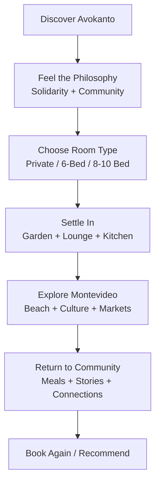
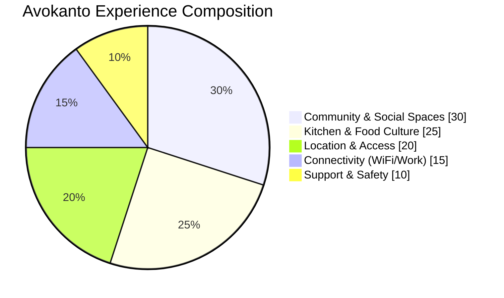
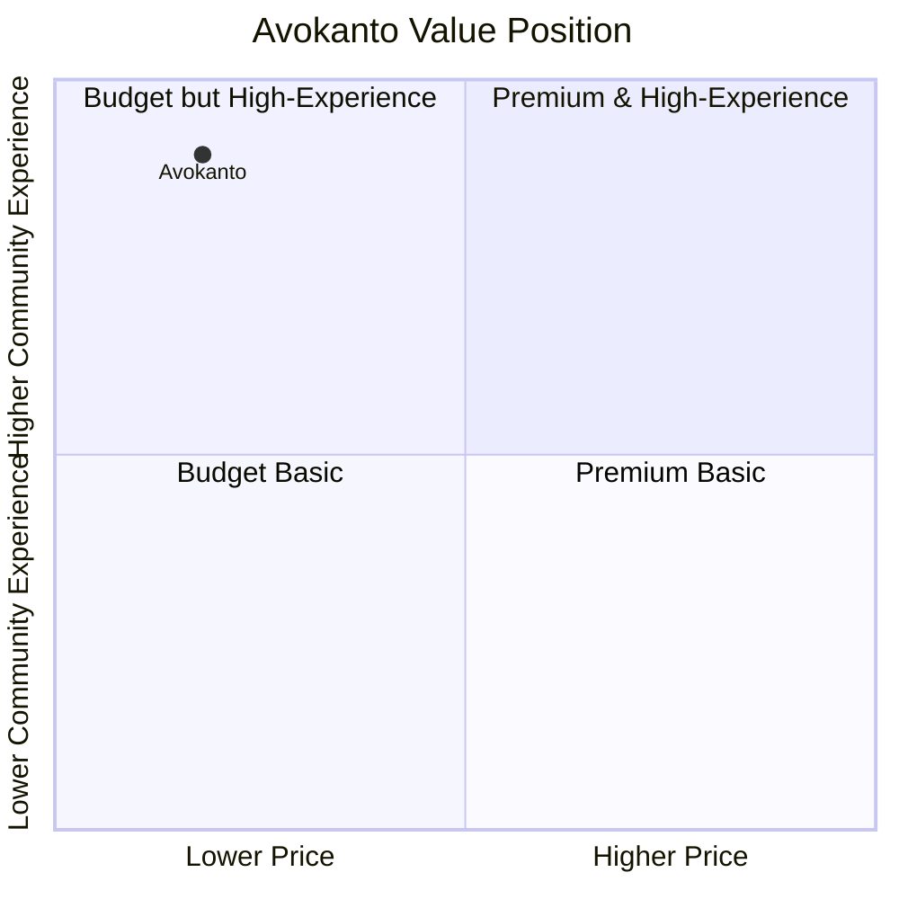

<div align="center">


<br/>


</div>

---

## 🌿 Welcome to Hostel Avokanto

**Hostel Avokanto** is a bohemian, community-first hostel in **Parque Rodó, Montevideo**—built around the Greek-inspired concept of **avokanto**: unconditional welcome, shared care, and human dignity.

This is not a sterile chain-hotel experience. It is a warm social base for travelers, backpackers, artists, and digital nomads looking for authentic connection in Uruguay’s capital.

---

## ✨ At a Glance

- 📍 **Address:** 2077 San Salvador, Parque Rodó, Montevideo, Uruguay  
- 🏖️ **Beach access:** ~6-minute walk to Ramírez Beach  
- 💸 **Budget-friendly:** from **$11/night**  
- 📶 **Internet:** **500+ Mbps** (supports 10+ devices)  
- 🍳 **Included:** free daily breakfast  
- 🧑‍🍳 **Social food culture:** staff-cooked meals and giant shared kitchen  
- 🕒 **Reception:** 24/7 with no curfew  
- ⭐ **Location rating:** 8.6/10

---

## 🎯 Why Travelers Choose Avokanto

| Highlight | Why it matters |
|---|---|
| **Community sanctuary** | Welcoming, social environment for all backgrounds |
| **Top-tier kitchen** | Fully equipped kitchen + easy access to fresh market produce |
| **Powerful WiFi** | Reliable setup for remote work and content creation |
| **Prime location** | Beach, culture, transport, and city landmarks all nearby |
| **Excellent value** | Strong amenities at hostel-level pricing |

---

## 🧭 Guest Experience Flow (Mermaid)



---

## 🛎️ Full Amenities & Features

### 1) Connectivity & Work
- **Blazing-fast WiFi (500+ Mbps)**
- Designed to support **10+ devices**
- Suitable for digital nomads and remote work routines

### 2) Food & Kitchen
- Large, fully equipped communal kitchen
- Daily staff-cooked meal culture
- **Free local breakfast** included
- Optional staff-prepared dinners
- Near weekly Wednesday street market (great for fresh ingredients)

### 3) Outdoor & Common Spaces
- Lush garden sanctuary
- Sun terrace and picnic zones
- Uruguayan BBQ facilities
- Shared lounge and game room
- Live social atmosphere with opportunities to meet travelers

### 4) Safety, Support & Flexibility
- **24/7 reception**
- Round-the-clock guest support
- No curfew
- Secure locker access across room types

---

## 🏠 Accommodation Options

| Room Type | Price (USD) | Capacity | Included Features |
|---|---:|---:|---|
| **Private Double Room** | $12–15 | 2 guests | Television, secure lockers, natural ventilation, high-speed WiFi, interior/exterior facing options |
| **6-Bed Mixed Dorm** | $11 | 6 guests | Secure lockers, natural ventilation, high-speed WiFi, spacious layout, clean shared bathrooms |
| **8–10 Bed Mixed Dorms** | $10–11 | 8–10 guests | Secure lockers, natural ventilation, high-speed WiFi, social atmosphere, budget-focused value |

---

## 📍 Location Advantage

### Key Distances
- 🏖️ Ramírez Beach — **6-minute walk**
- 🏙️ Downtown Center — **1.1 miles**
- 🚌 Tres Cruces Terminal — **2.0 km**
- ✈️ Carrasco Airport — **11 miles**

### Nearby Attractions
- Weekly Street Market (Wednesdays)
- Teatro de Verano
- National Library of Uruguay
- Pocito’s Avenue
- Salvo’s Palace
- Independencia Square
- Montevideo Harbour

---

## 📊 Amenities Mix (Mermaid Pie)



---

## 🌡️ Transparent “What to Expect”

Avokanto values radical honesty so guests can book with confidence.

- ❄️ **No AC by design:** fan + natural ventilation model in a historic building
- 🚿 **Shared bathrooms:** hot showers and bidets, cleaned frequently
- 🏛️ **Bohemian character:** authentic and lived-in, not luxury-hotel minimalism
- 🌤️ **Season note:** summer months (Dec–Feb) can feel warm

---

## 💡 Value Graph: Price vs Experience (Mermaid)



---

## 🕒 Check-in / Check-out

- **Check-in:** 2:00 PM – 11:00 PM  
- **Check-out:** before 11:00 AM  
- 24-hour reception available  
- Flexibility possible with advance notice  
- Free cancellation up to 72 hours before arrival  
- Cash payment upon arrival

---

## ❤️ Avokanto Philosophy

> “More than a hostel—a community shelter in the heart of Parque Rodó. Here, budget travelers discover warmth, unconditional welcome, and a genuine home in Montevideo.”

Core principles:
- **Unconditional welcome**
- **Community first**
- **Shared care through food and space**

---

## 🚀 Local Development (Website)

```bash
npm install
npm run dev
```

### Useful scripts
- `npm run dev` — start local dev server
- `npm run build` — build production bundle
- `npm run lint` — run ESLint
- `npm run preview` — preview built app

---

<div align="center">

### 🌎 Your sanctuary in Montevideo awaits.

**Hostel Avokanto · 2077 San Salvador · Parque Rodó · Uruguay**

</div>
